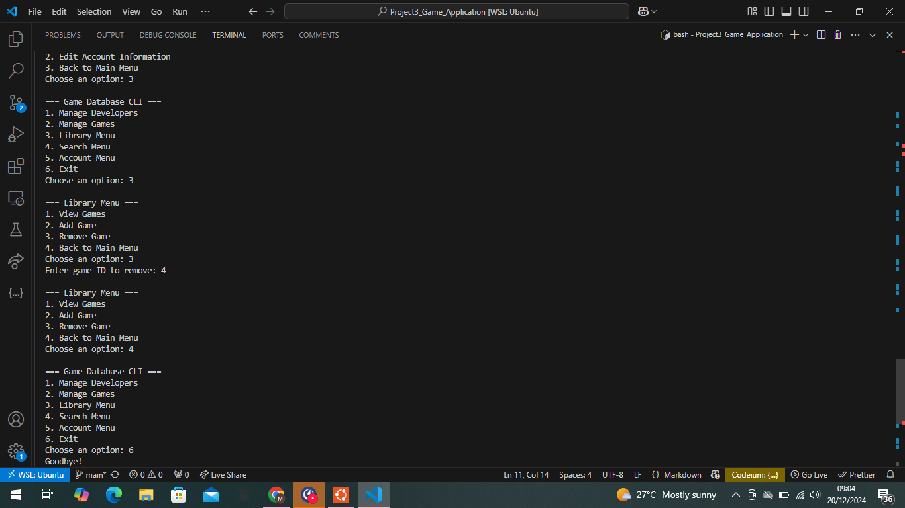

# Game Database CLI Application
Game DB is a Command Line Interface(CLI) application that is designed to help you manage your game library using a database.

By Marion Nafula

## Description
The Game Database CLI is a Python-based application for managing a database of games and developers. Users can create, view, search, and delete records for both games and developers using an interactive command-line interface (CLI).

This application is built with a modular structure to ensure scalability and maintainability.

## Screenshot

## Features
### 1. Developer Management
 - Add new developers.
 - List all developers.
 - Find a developer ID.
 - Delete a developer.

### 2. Game Management
 - Add new games.
 - List all games.
 - Find a game by ID.
 - Delete a game.

### 3. Library Menu
 - View, add, or remove games.

### 4. Search Menu
 - Search for games by name, genre, or developer.

### 5. Account Menu
 - View and edit account information (future enhancement).

## How to Use
### Main Menu
Upon starting the application, you will see the main menu:

=== Game Database CLI ===
1. Manage Developers
2. Manage Games
3. Library Menu
4. Search Menu
5. Account Menu
6. Exit
Choose an option by entering the corresponding number.

### Developer Management
**Create Developer:**Add a new developer by providing their name.
**List Developers:**View all developers in the database.
**Find Developer by ID:**Find Developer by ID:
**Delete Developer:**Remove a developer from the database.

### Game Management
**Create Game:**Add a new game by providing its name, genre, and associated developer ID.
**List Games:**View all games in the database.
**Find Game by ID:**Retrieve a specific game's details using its ID.
**Delete Game:**Remove a game from the database.

### Library Menu
**View Games:**Display all games in the library.
**Add Game:** Add a new game to the library.
**Remove Game:**Delete a game from the library.

### Search Menu
**Search by Name:**Find games by their name.
**Search by Genre:**Find games by their genre.
**Search by Developer:**Find games associated with a specific developer.

### Account Menu
**View Account Information:**Display user account details.
**Edit Account Information:**Modify user account details (future enhancement).

### Exiting the Application
Choose option `6` from the main menu to exit the application.

## Installation Process
### Prerequisites
Python 3.7 or later.

### Steps
1. Clone the repository:

`git clone git@github.com:MarionNafula/Game-Application.git.`
`cd Project3_Game_Application`

2. Install dependencies using Pipenv:

`pip install pipenv`
`pipenv install`

3. Activate the virtual environment:

`pipenv shell`

4. Run the application:

`python cli.py`

## Technologies Used
**Python:** Core language for application logic.
**SQLite:** Lightweight, file-based database system.
**Pipenv:** Dependency management and virtual environment.

## Support and Contact Details
If you have any questions, suggestions, or need assistance, please contact:
- Email: wekesamarion100@gmail.com
## Debugging
A debug.py script is provided for testing purposes. It initializes the database with sample data for developers and games.

To run the debug script:
`python debug.py`

## Contributing
1. Fork the repository.
2. Create a feature branch:
`git checkout -b feature-name`
3. Commit your changes:
`git commit -m "Add feature-name"`
4. Push to the branch:
`git push origin feature-name`

